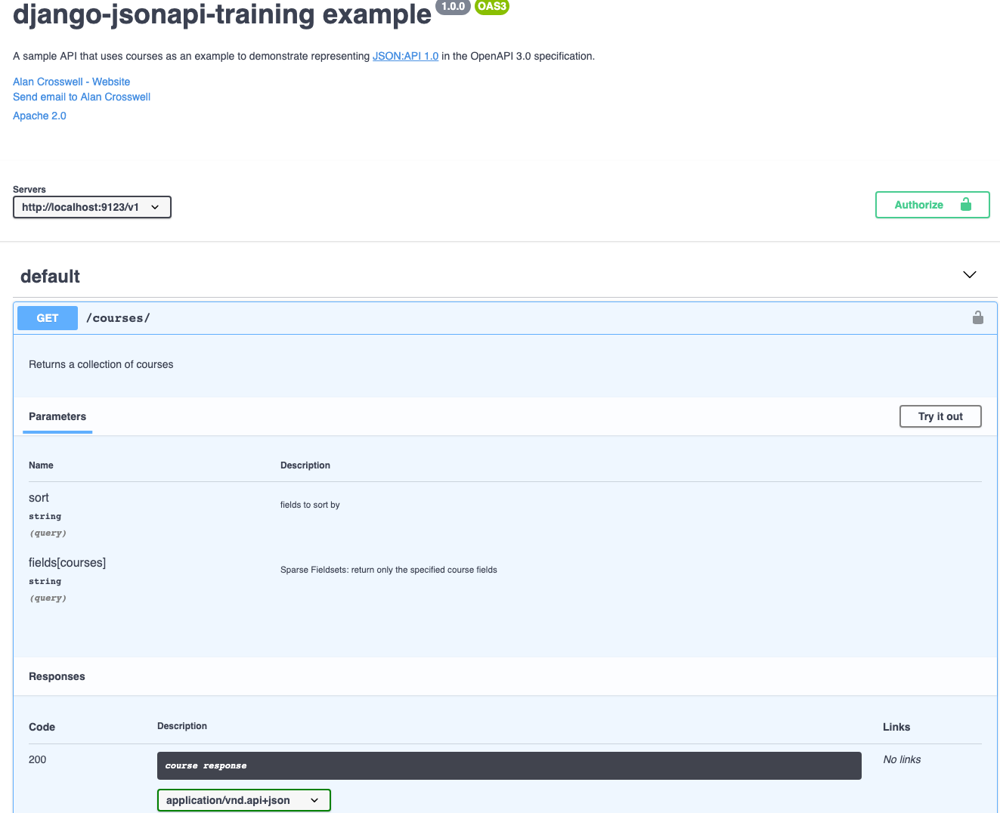
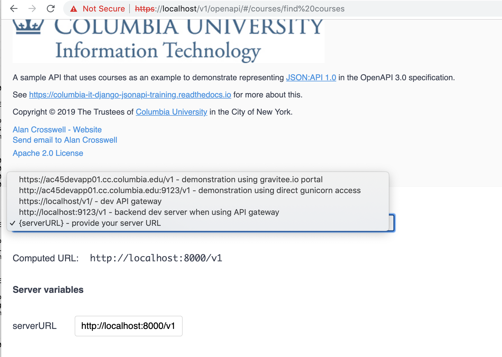

## Documenting the API in OAS 3.0

The [Open API Specification](https://github.com/OAI/OpenAPI-Specification/versions/3.0.0.md)
(OAS 3.0), a follow-on to Swagger 2.0 which merges in many of the
modeling features of
[RAML](https://raml.org/)
1.0, allows us to model and document our APIs
in a machine- and human-readable format. See the following example.
OAS 3.0 has become the standard machine-readable representation of API schemas.

DRF has _begun_ adding
[OAS 3.0](https://www.django-rest-framework.org/community/3.9-announcement/#built-in-openapi-schema-support)
support and will likely need some DJA enhancements before it is ready to automate generating a schema document.
But it looks like the ability to generate at least a rudimentary OAS schema starting from Models, Views
and Serializers may soone be a relaity.

### Why an OAS 3.0 Schema?

Having a standardized schema document enables API consumer and producer developers to formally agree on the
API details in an automated way, providing tools for developers to perform basic data input validation
and to provide developer documentation and the familiar swagger "Try it!" functionality.



### Experiments with OpenAPI Schema documentation, validation and mocking tools

While "waiting" on automated OAS schema generation, I've been experimenting with manually coding a schema
to get a feeling for the value of eventually having automated schema generation.

#### Composing the OAS Schema with external references.

To make things DRYer, the OAS schema can be decomposed into shareable pieces that are referenced via the `$ref` tag.
These can be files in the same directory as the schema file or reachable via http references.  For example,
replace `"$ref": "#/components/schemas/CourseAttributes"` with 
`"$ref": "Course.json#/definitions/CourseAttributes"` or
`"$ref": "http://www.columbia.edu/~alan/schemas/sas/Course.json#/definitions/CourseAttributes"`.

#### The jsonapi OAS schema

This [jsonapi schema include file](http://www.columbia.edu/~alan/schemas/common/jsonapi.yaml)
is referenced by `myapp.yaml` and contains the {json:api} common definitions that myapp references.

#### Myapp's OAS 3.0 schema with swagger Try It functionality

This hand-written schema actually works and allows "Try It!" functionality with the following caveats:
- Change the API port to 9123 in PyCharm since the default port for swagger-ui-watcher is 8000.
- OAuth2 clients need to be configured that include these request_uris:
  - http://127.0.0.1/oauth2-redirect.html
  - http://localhost/oauth2-redirect.html

Both Basic Auth and OAuth2 logins are supported.

See `docs/schemas/myapp.yaml`

Here are some abbreviated snippets of myapp.yaml:
```yaml
openapi: 3.0.2
info:
  version: 1.0.0
  title: 'django-jsonapi-training example'
  description: >-
    A sample API that uses courses as an example to demonstrate representing
    [JSON:API 1.0](http://jsonapi.org/format) in the OpenAPI 3.0 specification.
  contact:
    name: Alan Crosswell
    email: alan@columbia.edu
    url: 'http://www.columbia.edu/~alan'
  license:
    name: Apache 2.0
    url: 'https://www.apache.org/licenses/LICENSE-2.0.html'
servers:
  - url: 'http://localhost:9123/v1'
paths:
  /courses/:
    get:
      description: Returns a collection of courses
      operationId: find courses
      security:
        - basicAuth: []
        - oauth-dev: [auth-columbia, read]
      responses:
        '200':
          description: course response
          content:
            application/vnd.api+json:
              schema:
                $ref: '#/components/schemas/CourseCollection'
components:
  securitySchemes:
    basicAuth:
      type: http
      scheme: basic
    oauth-dev:
      type: oauth2
      flows:
        authorizationCode:
          authorizationUrl: https://oauth-dev.cuit.columbia.edu:8443/as/authorization.oauth2
          tokenUrl: https://oauth-dev.cuit.columbia.edu:8443/as/token.oauth2
          scopes:
            "auth-columbia": Columbia UNI login
            create: create
            read: read
            update: update
            delete: delete
            openid: disclose your identity
            profile: your user profile
            email: your email address
            "https://api.columbia.edu/scope/group": groups you are a member of
            "demo-netphone-admin": Administrative access to netphone resources
  schemas:
  # ...
    CourseCollection:
      type: array
      items:
        $ref: '#/components/schemas/CourseItem'
    CourseItem:
      allOf:
        - $ref: 'http://www.columbia.edu/~alan/schemas/common/jsonapi.yaml#/components/schemas/resource'
        - type: object
          properties:
            attributes:
              $ref: '#/components/schemas/CourseSchema'
            relationships:
              $ref: '#/components/schemas/CourseRelationships'
```

#### swagger-editor

Swagger-editor installs as a
[docker container](https://github.com/swagger-api/swagger-editor#docker)
and then runs an in-browser schema editor. It's main failings are:
- the editor stores files in the container so you have to explicitly export files to the local filesystem.
- it does not follow network `$ref`s (e.g. to `http://www.columbia.edu/~alan/schemas/sas/Course.json`)


#### swagger-ui-watcher

Swagger-ui-watcher lets you edit the API definition in your favorite text editor and updates the browser view
dynamically as the file changes. Otherwise it looks just like swagger-editor. It also properly follows
`$ref` network URIs.

To run it:

`npm install swagger-ui-watcher -g` then `swagger-ui-watcher ./openapi.yaml`

You can use `swagger-ui-watcher` to "bundle" you app's OAS schema with the external schemas that it
references. The bundled output file is always a JSON document.

```
schemas$ swagger-ui-watcher -b myapp.json myapp.yaml
```

#### Schema validation with apistar

While the swagger-ui packages will validate a schema, with error messages popping up in the browser window,
you can also do command-line OAS schema validation with a number of tools. A cool new one is
[apistar](https://docs.apistar.com/):

```text
docs$ pip install apistar
docs$ apistar validate  --path schemas/myapp.json --format openapi
✓ Valid OpenAPI schema.
```

#### Working around a missing oauth2-redirect.html in swagger-editor and swagger-ui-watcher

The swagger-editor distribution package (and therefore swagger-ui-watcher as well) currently fails to finish a proper OAuth2
login because a 404 not found happens for a [missing /oauth2-redirect.html](https://github.com/swagger-api/swagger-editor/issues/1969).

##### swagger-ui-watcher

The (hopefully temporary) [workaround](https://github.com/moon0326/swagger-ui-watcher/issues/31#issuecomment-476799840)
for swagger-ui-watcher is to grab a copy of
[oauth2-redirect.html](https://github.com/swagger-api/swagger-ui/blob/master/dist/oauth2-redirect.html)
and:
```text
cp oauth2-redirect.html /usr/local/lib/node_modules/swagger-ui-watcher/node_modules/swagger-editor-dist/
```

##### swagger-editor docker

```text
swagger-editor$ docker exec -it heuristic_mirzakhani sh
/ # cd /usr/share/nginx/html/
/usr/share/nginx/html # # I had a copy already salted away ...
/usr/share/nginx/html # mv oauth2-redirect.htmlx oauth2-redirect.html
/usr/share/nginx/html # exit
swagger-editor$ docker restart heuristic_mirzakhani
heuristic_mirzakhani
```

#### Some issues I have with OAS 3.0

It's not a DRY as I want it to be:

* `$ref` can't generally be used to set some values and then extend them.
* There are no parameterized macros like in
  [RAML](https://github.com/raml-org/raml-spec/blob/master/versions/raml-10/raml-10.md#resource-type-and-trait-parameters).

As such, OAS 3.0 is more suited as a machine-generated file format than something a human should be expected to compose
for any kind of sophisticated API framework like {json:api}.
To get any kind of reuse out of an OAS document, it will need to be pre-processed with something like
[m4](https://www.gnu.org/software/m4) to basically add parameter substitutions.

There are [proposed improvements in OAS 3.1](https://github.com/OAI/OpenAPI-Specification/issues/1466)
that may fix this in the future.

### Adding the Swagger UI to my app

See [this article](https://dev.to/matthewhegarty/swaggerui-inside-django-rest-framework-1c2p) which
outlines the steps to add Swagger UI at the /v1/openapi path.

A bunch of new files are added in `myapp/static/` and `myapp/templates/` to add the Swagger-UI code
and `myapp.json` which was [bundled above](#swagger-ui-watcher).

```text
(env) django-training$ tree myapp/static/
myapp/static/
├── oauth2-redirect.html
└── openapi
    ├── myapp.json
    └── swagger-dist-ui
        ├── favicon-16x16.png
        ├── favicon-32x32.png
        ├── oauth2-redirect.html
        ├── swagger-ui-bundle.js
        ├── swagger-ui-bundle.js.map
        ├── swagger-ui-standalone-preset.js
        ├── swagger-ui-standalone-preset.js.map
        ├── swagger-ui.css
        ├── swagger-ui.css.map
        ├── swagger-ui.js
        └── swagger-ui.js.map

2 directories, 13 files

(env) django-training$ tree myapp/templates/
myapp/templates/
└── index.html
```

You have to edit index.html to add the static templating (`{stuff in brackets}`) and the filename
for our app's OAS 3.0 spec:

```javascript
...
    window.onload = function() {
      // Begin Swagger UI call region
      const ui = SwaggerUIBundle({
        url: "",
        dom_id: '#swagger-ui',
        deepLinking: true,
...
```

Add a STATIC_ROOT to settings which tells `manage.py collectstatic` where to put them:

```diff
 STATIC_URL = '/static/'
+STATIC_ROOT = '/var/www/html'
```

Also add some urlpattern changes in urls.py to bring in the templated index.html added above as well
as special-handling of `/oauth2-redirect.html` which wants to be top-level rather than below
the STATIC_URL.

```diff
+from django.contrib.staticfiles.views import serve
+from django.views.generic.base import RedirectView, TemplateView
@@ -73,6 +74,10 @@ urlpatterns = [
+    # swagger UI
+    path('v1/openapi/', TemplateView.as_view(template_name="index.html")),
+    # The default request_uri is /oauth2-redirect.html (no /static prefix) so just pass it into staticfiles serve():
+    path('oauth2-redirect.html', serve, {'path': 'oauth2-redirect.html'}),
```

We also have to update setup.py to package the required static and template
files by adding a MANIFEST.in:

```text
recursive-include myapp/static *
recursive-include myapp/templates *
```

After doing this, open `/v1/openapi` in a browser and you should get the Swagger-UI.
Note that our OAuth2 client will need to have registered the appropriate `redirect_uri`.

#### Selecting the correct Server in Swagger-UI

N.B. Make sure that when you use the Swagger-UI that you select the correct server from the Servers list at the top
as I've added several in `myapp.yaml`.

When running under PyCharm or runserver, choose `{serverURL} - provider your server URL` and use the default
of `http://localhost:8000/v1`. Also make sure when authenticating to use the same OAuth2 server that is being
introspected (`OAUTH2_SERVER` environment variable).

When running the docker-compose configuration (described in the next section),
use `https://localhost/v1/ - dev API gateway`.

As you can see, this Swagger-UI document has no real connection with your backend server; It's just convenient
to hang it off your server, especially when developing.


